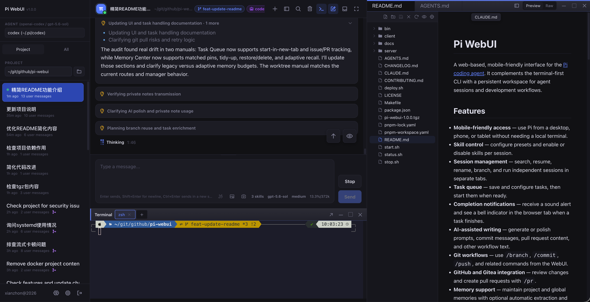
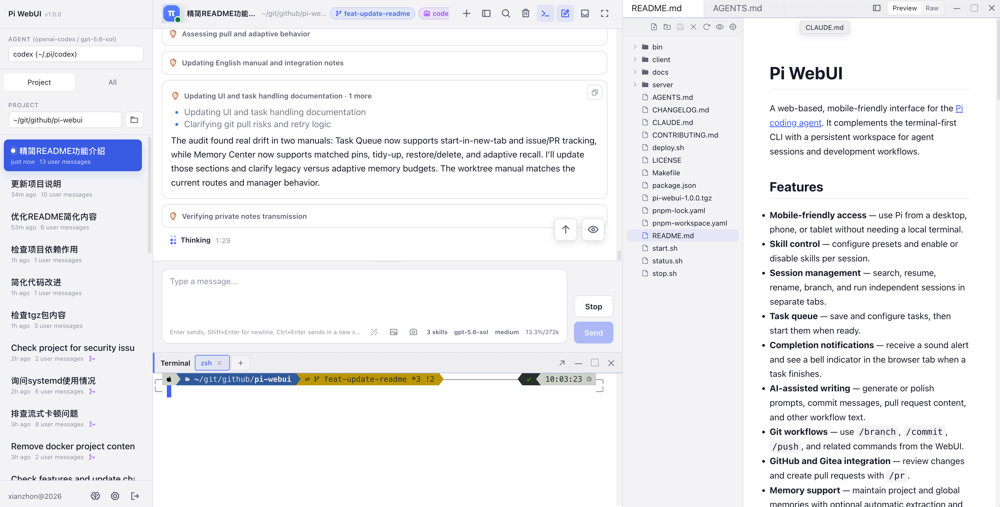

# Pi WebUI

[English](README.md) | 简体中文

一个基于 Web、适配移动设备的 [Pi 编程智能体](http://pi.dev)界面。它为以终端为主的 CLI 提供了补充，让智能体会话和开发工作流拥有一个持久化工作区。

| 深色主题                                                           | 浅色主题                                                            |
| ------------------------------------------------------------------ | ------------------------------------------------------------------- |
|  |  |

**[▶ 观看 Pi WebUI 完成 Git 缺陷修复工作流](https://xianzhon.github.io/pi-webui-website/assets/videos/demo-git-bugfix-workflow.mp4)**

## 功能特性

- **移动端友好** — 无需本地终端，即可在电脑、手机或平板上使用 Pi。
- **技能控制** — 配置预设，并为每个会话启用或禁用技能。
- **会话管理** — 搜索、恢复、重命名和分支会话，并在不同标签页中运行独立会话。
- **任务队列** — 保存和配置任务，准备就绪后再启动。
- **完成通知** — 任务完成时接收提示音，并在浏览器标签页中看到铃铛提示。
- **AI 辅助写作** — 生成或润色提示词、提交信息、拉取请求内容及其他工作流文本。
- **Git 工作流** — 在 WebUI 中使用 `/branch`、`/commit`、`/push` 等命令。
- **GitHub 和 Gitea 集成** — 使用 `/pr` 审查更改并创建拉取请求。
- **记忆支持** — 维护项目级和全局记忆，并可选择自动提取和自适应召回。
- **消息网关** — 通过简洁的配置接入飞书和微信。
- **工作区工具** — 浏览和搜索文件、编辑代码，并在对话旁使用内嵌终端。
- **安全访问** — 使用密码和可选的 TOTP 身份验证保护 WebUI。

## 快速开始

### 前置要求

- Node.js 22 或更高版本
- pnpm 9 或更高版本（仅从源码开发时需要）

Pi WebUI 已包含 [Pi 编程智能体](http://pi.dev)，因此使用 API 密钥进行身份验证时无需单独安装 `pi`。API 密钥可以在 Agent 配置对话框中设置。

WebUI 目前尚不支持 OAuth 订阅登录；原生 OAuth 支持已列为未来改进计划。现阶段若要使用 OAuth，请安装独立的 Pi CLI，并以运行 Pi WebUI 的同一操作系统用户在终端中完成 `/login`：

```bash
npm install -g --ignore-scripts @earendil-works/pi-coding-agent
pi
# 输入 /login 并选择提供商
```

之后，Pi WebUI 会检测默认 `~/.pi/agent` 配置中存储的 OAuth 凭据。

### 无需安装直接运行

如果 npm 在构建原生依赖时失败，请安装 `build-essential`、`python3` 等系统构建工具，然后重试。

设置登录凭据，然后运行最新版本：

```bash
PI_WEBUI_AUTH_USERNAME=pi PI_WEBUI_AUTH_PASSWORD='change-this-password' npx @xianzhon/pi-webui@latest
```

打开 http://127.0.0.1:3000。服务器准备就绪后，CLI 会自动打开浏览器。

### 全局安装

```bash
npm install -g @xianzhon/pi-webui
pi-webui
```

首次运行时，Pi WebUI 会创建受保护的配置文件，用户名默认为 `admin`，并仅显示一次随机生成的密码。

请参阅[配置手册](docs/manuals-cn/configuration.md)，了解如何自定义凭据、端口和其他设置。如需远程或公网访问，请参阅[部署手册](docs/manuals-cn/deployment.md)。

### 作为系统服务运行

在 Linux、macOS 或 Windows 上将 Pi WebUI 安装为开机启动服务：

```bash
pi-webui service install
pi-webui service status
```

在 Windows 上，防病毒软件可能会阻止 `pi-webui service install`，因为该命令会创建自动启动的计划任务。允许前请核对防病毒软件的检测内容；请勿禁用防病毒软件，也不要排除整个 npm 目录。

### 从源码运行

```bash
git clone https://github.com/xianzhon/pi-webui && cd pi-webui
pnpm install
cp .env.example .env    # 设置 PI_WEBUI_AUTH_USERNAME 和 PI_WEBUI_AUTH_PASSWORD
pnpm dev
```

开发期间请打开 http://localhost:5173。生产服务器监听 `PORT`（默认值为 `3000`）。

## 配置

基本设置如下：

| 变量                       | 说明                              |
| -------------------------- | --------------------------------- |
| `PI_WEBUI_AUTH_USERNAME` | 登录用户名                        |
| `PI_WEBUI_AUTH_PASSWORD` | 简单部署所使用的登录密码          |
| `PORT`                   | 后端端口（默认值：`3000`）      |
| `HOST`                   | 绑定地址（默认值：`127.0.0.1`） |

生产环境中，请使用 `PI_WEBUI_AUTH_PASSWORD_HASH`，而不是明文密码。有关配置文件、安全、会话、存储、工作区、记忆、提供商和网关设置，请参阅[配置手册](docs/manuals-cn/configuration.md)。

## 部署

有关源码和 npm 软件包部署以及 nginx 反向代理配置，请参阅[部署手册](docs/manuals-cn/deployment.md)。

## 文档

浏览[文档索引](docs/README.md)，查看全部用户手册和开发者参考资料。

## 开发

```bash
pnpm dev                  # 启动前后端服务器
pnpm build                # 类型检查并构建前后端
pnpm test                 # 运行所有测试
```

- 前端：http://localhost:5173（Vite，将 `/api` 和 `/ws` 代理到后端）
- 后端：http://localhost:3000（Fastify）
- 日志：`.logs/`
- PID 文件：`.pids/`

有关架构、API、本地软件包测试和项目目录结构的说明，请参阅[开发者说明（英文）](docs/to-developers/developer-notes.md)。

## 贡献

欢迎贡献。有关开发环境设置、分支和拉取请求规范、测试、文档要求及安全问题报告方式，请参阅 [CONTRIBUTING.md（英文）](CONTRIBUTING.md)。

## 许可证

本项目采用 Apache License 2.0 许可。详情请参阅 [LICENSE](./LICENSE)。
